# Login-JWT
[Versão do Projeto][version]
[Front][react]
[Back][node]
[Database][db]

> Sistema de login com autenticação JWT

Projeto feito em ReactJS, NodeJS e Mysql que busca entender a fundo como funciona o Json Web Token e qual sua funcionalidade quando se trata de requisições HTTP

---

## Tecnologias

O projeto em questão faz uso de:

* [![axios][axios]
* [reactstrap][reactstrap]
* [bootstrap][bootstrap]
* [bcrypt][bcrypt]
* [cors][cors]
* [express][express]
* [jwt][jwt]
* [nodemon][nodemon]
* [mysql2][mysql2]
* [sequelize][sequelize]

---

## Rodando o Projeto

Clone o projeto em um repositório:
```
git clone <link>
```

Acesse a pasta do back-end e instale as dependências
```
cd login\server && npm install
```

Saia da pasta server
```
cd ..
```

Entre na pasta do front-end e baixe os pacotes
```
cd client && npm install
```

Assim que o npm terminar de instalar os pacotes, você precisa configurar seu MySQL Workbench antes que possa rodar o projeto, para isso, veja abaixo uma sequência de imagens que podem ser úteis: 
<p>Passo 1:</p>
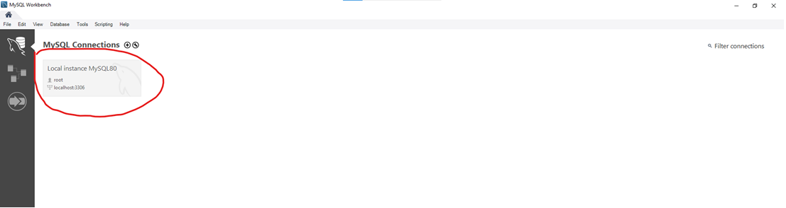
<p>Passo 2:</p>
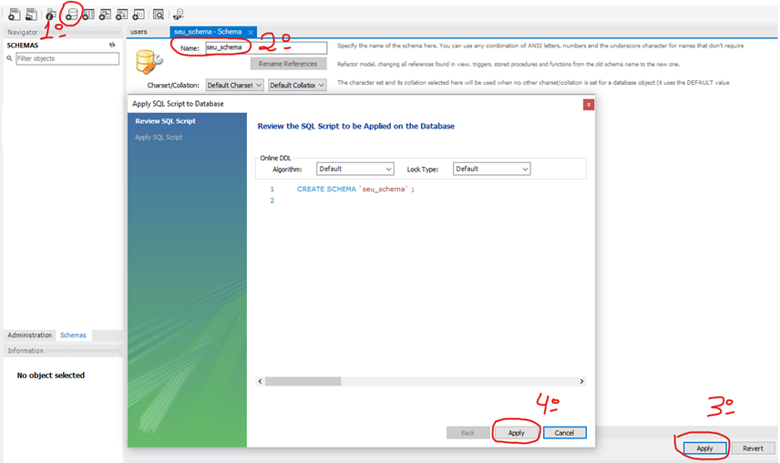
<p>Passo 3:</p>
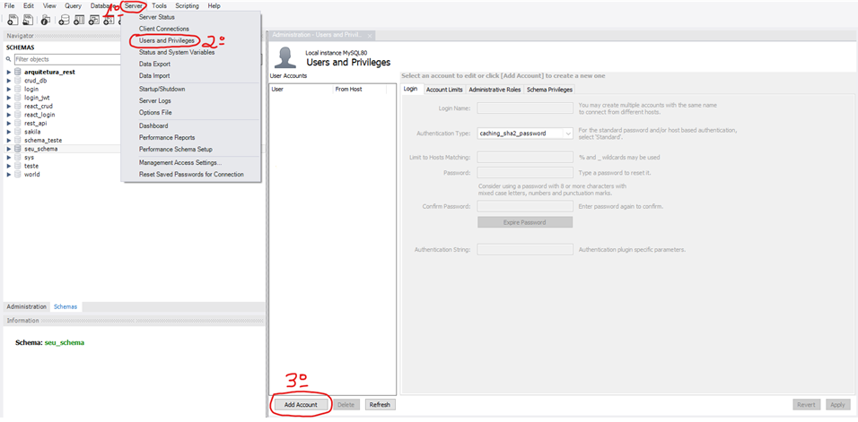
<p>Passo 4:</p>
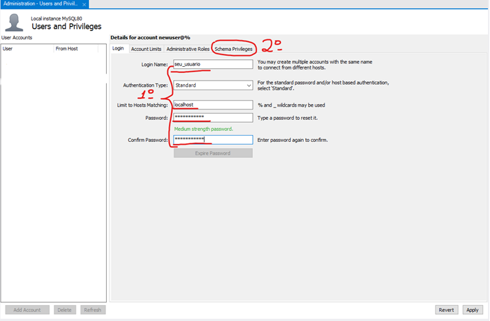
<p>Passo 5:</p>
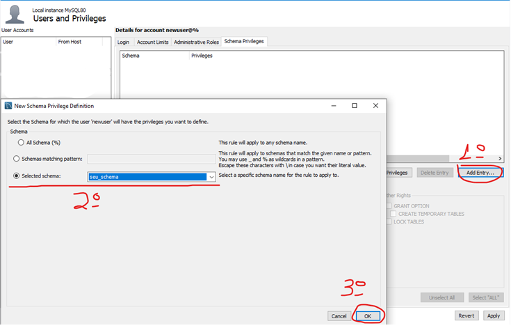
<p>Passo 6:</p>
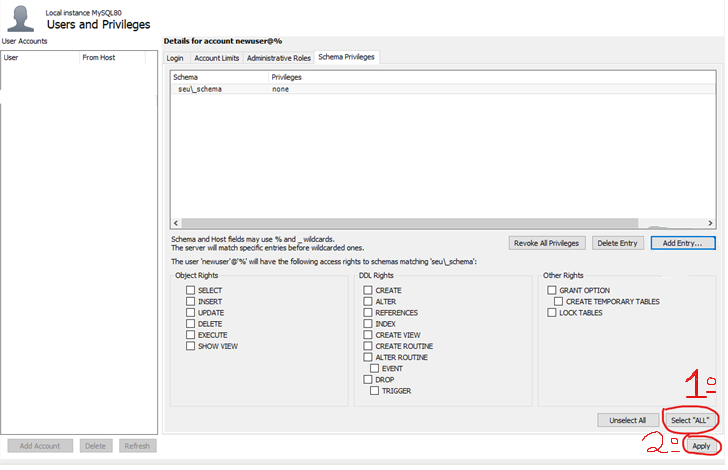

Com o banco conectado rode o cliente com:
```
npm start
```

Em seguida com outro prompt de comando, rode o servidor:
```
cd login\back-end && npm run start
```

---

## Como Utilzar

<p>Página inicial</p>
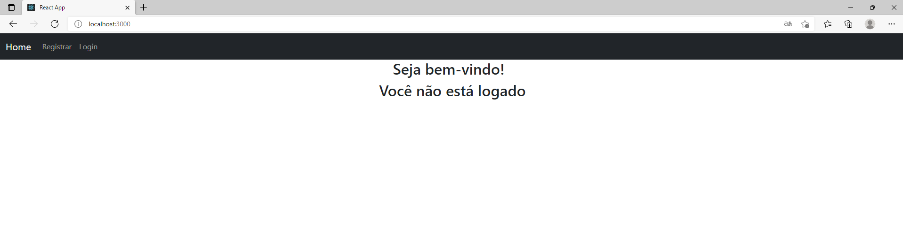
<p>Cadastre-se</p>
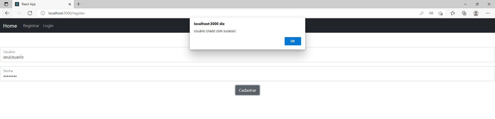
<p>Login</p>
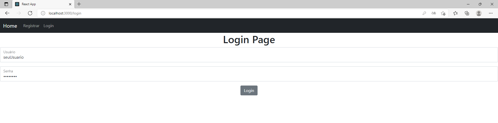
<p>Home page após Login</p>
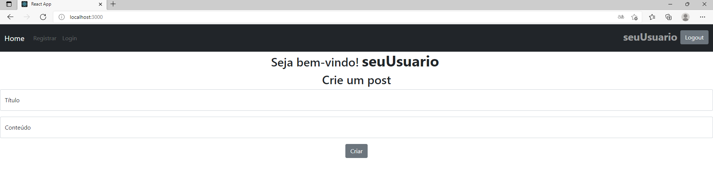
<p>Crie um post</p>
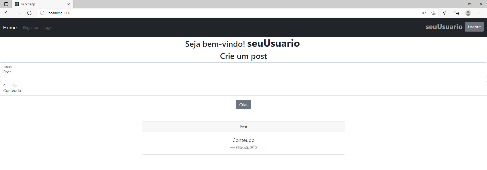

---

## Autores

* *Camili Martins*
* *Emelly Costa*
* *Patricia Soares*
* *Thiago Amorim*
* *Victor Gomes*
* *Vinícius Sanches*

<!-- Imagens e Links -->
[version]: https://img.shields.io/badge/Version-1.0.0-brightgreen?style=for-the-badge&logo=appveyor
[react]: https://img.shields.io/badge/Frontend-React-blue?style=for-the-badge
[node]: https://img.shields.io/badge/Backend-Node-important?style=for-the-badge
[db]: https://img.shields.io/badge/Database-Mysql-9cf?style=for-the-badge
[axios]: https://img.shields.io/badge/Front-Axios-blue?style=for-the-badge
[reactstrap]: https://img.shields.io/badge/Front-Reactstrap-blue?style=for-the-badge
[bootstrap]: https://img.shields.io/badge/Front-Bootstrap-blue?style=for-the-badge
[bcrypt]: https://img.shields.io/badge/Back-Bcrypt-important?style=for-the-badge
[cors]: https://img.shields.io/badge/Back-cors-important?style=for-the-badge
[express]: https://img.shields.io/badge/Back-express-important?style=for-the-badge
[jwt]: https://img.shields.io/badge/Back-jwt-important?style=for-the-badge
[nodemon]: https://img.shields.io/badge/Back-nodemon-important?style=for-the-badge
[mysql2]: https://img.shields.io/badge/DB-Mysql2-9cf?style=for-the-badge
[sequelize]: https://img.shields.io/badge/DB-Sequelize-9cf?style=for-the-badge